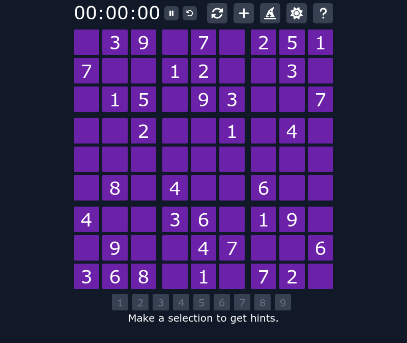

# <a alt="Nx logo" href="https://nx.dev" target="_blank" rel="noreferrer"></a> Sudoku

This repository leverages Nx, a powerful monorepo tool, to manage a collection of projects centered around creating Sudoku applications using different frontend technologies. It promotes code reusability, efficient development, and a shared foundation for consistency across applications.

## 🔑 Key Features

 - **Modular:** The core package encapsulates styling, state management, types and event handling logic, enabling framework-agnostic reuse and reducing duplicate code.

 - **Flexible:** Experiment with different frameworks (React, Solid, Vue, Svelte) for the Sudoku app to evaluate their strengths and suitability.

 - **Organized:** Nx's structure keeps things clear and maintainable, separating applications and sharing code effectively.

 - **Efficient:** Leverage built-in Nx commands for streamlined development tasks like building, testing, and linting across all projects.

## 🏗️ Structure
```
projects/
  confetti/         # P5 sketch function for confetti
  core/             # Shared code for Sudoku app
  fns/              # Functional Programming Helpers
  lit/              # WIP Sudoku app implementation in Lit
  preact/           # WIP Sudoku app implementation in Preact
  qwik/             # WIP Sudoku app implementation in Qwik
  react/            # Sudoku app implementation in React
  solid/            # Sudoku app implementation in Solid
  svelte/           # Sudoku app implementation in Svelte
  typescript/       # Sudoku app implementation in TypeScript without a framework
  vue/              # Sudoku app implementation in Vue
```
## 🦺 Functional Foundations

While this monorepo lets you explore Sudoku through popular frameworks, its true magic lies in embracing a functional approach, particularly within the shared core package.

 - **Immutability:** The core package adheres to functional principles, favoring immutable data structures and pure functions with well-defined inputs and outputs. This leads to code that's easier to reason about, debug, and trust.

 - **fp-ts Power:** The project uses the powerful fp-ts library to bring functional programming concepts to life. Expect to see structures like Option, Monoid, and Lens managing data flow and error handling gracefully, promoting code clarity and modularity.

## 🎀 Tailwind Styling

 This project uses Tailwind CSS for clean and consistent styling across different frameworks. A well-structured object in `packages/core/style/index.ts` defines styles for various components like the menu and board. It supports dynamic styling based on cell states and light/dark themes, ensuring a visually appealing and adaptable Sudoku experience.

## 🎉 P5 Confetti Magic

This Nx monorepo adds a touch of celebratory flair with an integrated P5 sketch function for drawing dynamic confetti explosions! Nestled within `packages/confetti`, this reusable function seamlessly integrates into any framework-specific application, using framework-specific mechanisms (e.g., custom components, hooks).

## 🛠️ Start Development Server

To start a Sudoku app development server for a particular framework use:

```
npx nx run <project>:dev
```
Example:
```
npx nx run svelte:dev
```

## 🎧 Demos
### [https://react.zerf.dev/](https://react.zerf.dev/)
### [https://solid.zerf.dev/](https://solid.zerf.dev/)
### [https://svelte.zerf.dev/](https://svelte.zerf.dev/)
### [https://typescript.zerf.dev/](https://typescript.zerf.dev/)
### [https://vue.zerf.dev/](https://vue.zerf.dev/)

